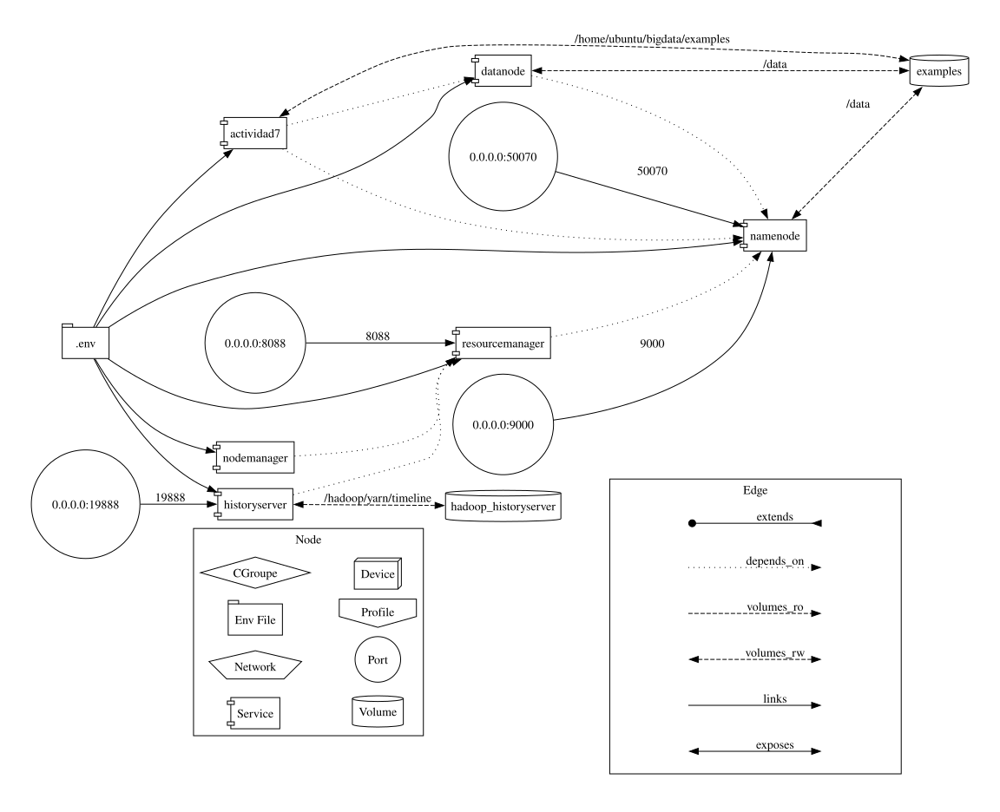

# Actividad 7 - HDFS

Este proyecto proporciona una configuración mínima y automatizada para trabajar con **HDFS** usando **Docker**, cargando automáticamente contenido al sistema distribuido al iniciar los contenedores.



---

## Estructura y contenido del proyecto

```
actividad7/
├── Dockerfile
├── docker-compose.yml
├── Makefile
├── .env.example
├── entrypoint.sh
├── setup/
│   └── actividad7.sh
├── hadoop-config/
│   ├── core-site.xml
│   ├── hdfs-site.xml
│   ├── mapred-site.xml
│   └── yarn-site.xml
└── home/
    └── ubuntu/
        └── bigdata/
            └── examples/
                ├── books/
                │   ├── frankenstein.txt
                │   └── Quijote.txt
                └── hdfs/
                    └── fichero_result.zip
```

- `Dockerfile` → Imagen personalizada basada en Ubuntu 20.04 con Hadoop 2.7.4 y configuración manual de HDFS y YARN.
- `docker-compose.yml` → Define los servicios necesarios: NameNode, DataNode, ResourceManager, NodeManager, HistoryServer, etc.
- `Makefile` → Automatiza tareas como build, run, stop, logs, stats, carga de datos, etc.
- `.env.example` → Archivo de ejemplo con variables de entorno configurables.
- `entrypoint.sh` → Script de arranque principal que lanza cada servicio según el comando recibido.
- `setup/actividad7.sh` → Script que realiza todas las tareas del ejercicio: crear directorios, cargar ficheros, descomprimir y mover archivos en HDFS.
- `hadoop-config/` → Archivos XML con la configuración completa de Hadoop (core, HDFS, MapReduce, YARN).
- `home/ubuntu/bigdata/examples/` → Estructura de carpetas que simula un entorno Linux típico dentro del contenedor. Aquí deben colocarse los archivos de entrada para HDFS:
  - `/books` → Ficheros de texto de ejemplo.
  - `/hdfs` → Archivo comprimido `fichero_result.zip`.

---

## Requisitos previos

- [Docker](https://docs.docker.com/get-docker/)
- [Make](https://www.gnu.org/software/make/) (en Linux/Mac viene por defecto; en Windows puedes usar WSL o Git Bash)

---

## Instrucciones de uso

### 1. Clonar el repositorio

```bash
git clone git@github.com:asier-ortiz/ai-course-notebooks.git
cd ai-course-notebooks/actividad7
```

### 2. Crear el archivo `.env`

```bash
cp .env.example .env
```

Edita el `.env` si quieres cambiar:

- Nombre de imagen o contenedor
- Plataforma (`PLATFORM`: `linux/amd64` o `linux/arm64`)
- Ruta del volumen de entrada (`INPUT_DIR`)
- Usuario de HDFS (`HDFS_USER_NAME`)

Asegúrate de que los archivos de entrada estén colocados en la ruta `home/ubuntu/bigdata/examples/` según la estructura indicada arriba.

### 3. Construir y arrancar todo automáticamente

```bash
make start
```

Este comando:

- Construye las imágenes Docker
- Lanza todos los servicios en segundo plano
- Formatea el NameNode si es necesario
- Ejecuta automáticamente el script `setup/actividad7.sh`, que:
  - Crea directorios en HDFS (`/books`, `/user/...`)
  - Carga los libros en `/books`
  - Descomprime y sube el archivo `fichero_result.txt`
  - Mueve `frankenstein.txt` dentro de HDFS y lo descarga al host

### 4. Verificar ejecución del script

Para revisar la salida del script de carga automática:

```bash
make actividad-log
```

---

## Comandos útiles

- `make bash` → Accede al contenedor del NameNode
- `make logs` → Muestra los logs de todos los servicios
- `make stats` → Monitoriza el uso de recursos
- `make down` → Detiene y elimina todos los contenedores
- `make clean` → Elimina contenedores, imágenes, volúmenes y redes huérfanas
- `make prune` → Limpia redes huérfanas de Docker
- `make reset` → Elimina todo y borra también los archivos de ejemplo
- `make actividad-run` → Ejecuta `actividad7.sh` de forma aislada en un contenedor temporal
- `make actividad-log` → Muestra el log generado por `actividad7.sh`

**Para más detalles, puedes consultar el [Makefile](./Makefile) donde están definidos todos estos comandos.**

---

## Acceso a la interfaz web

- NameNode UI: [http://localhost:9870](http://localhost:9870)
- ResourceManager UI: [http://localhost:8088](http://localhost:8088)
- HistoryServer UI: [http://localhost:19888](http://localhost:19888)

---

## Notas

- Basado en una instalación manual de Hadoop 2.7.4 sobre Ubuntu 20.04.
- Si usas Mac con chip M1/M2/M3 (ARM64), define `PLATFORM=linux/amd64` en `.env`. Docker usará emulación automáticamente.
